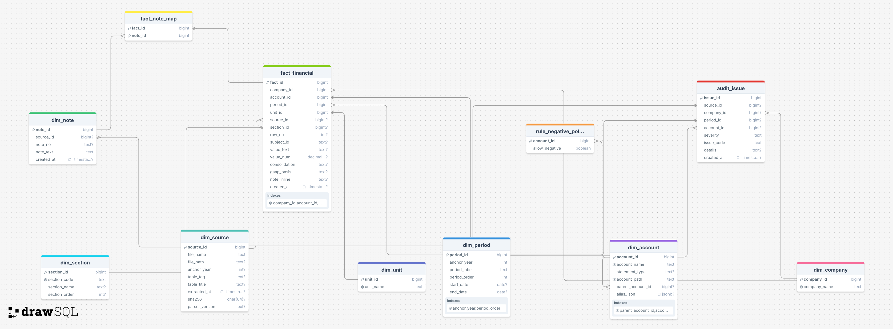

# Audit Finance Database 스키마 설명

## 1. 개요
- 데이터베이스명: auditdb  
- 스키마명: audit_finance  
- 목적:  
  - 감사보고서에서 파싱된 재무제표(값 + 메타데이터)를 표준화하여 저장  
  - 10년 이상 데이터를 누적 관리 → 검색, QA, 분석, 머신러닝 학습에 활용  
  - 수습 회계사 QA 시스템, 핵심감사사항(KAM) 분석 등 감사품질 지원에 적용  

## 2. 스키마 구조
### 2.1 차원 테이블 (dim_)
- dim_company: 회사 마스터 정보 관리  
  - 예시 컬럼: company_id, company_name  
- dim_account: 계정 사전 (계층 구조, 표준 계정명, 별칭 매핑 포함)  
  - 예시 컬럼: account_id, account_name, account_path, parent_account_id  
- dim_account_alias: 계정별 별칭 매핑 테이블 (회사별 다른 표기 관리용, 선택적)  
  - 예시 컬럼: alias_id, account_id, alias_text  
- dim_period: 기간 정의 (연도, 당기/전기 등)  
  - 예시 컬럼: period_id, anchor_year, period_order, start_date, end_date  
- dim_unit: 단위 정의 (백만원, 천원 등)  
  - 예시 컬럼: unit_id, unit_name  
- dim_source: 원본 파일 메타데이터  
  - 예시 컬럼: source_id, file_name, file_path, sha256  
- dim_section: 재무제표 구분  
  - 예시 컬럼: section_id, section_code  
- dim_note: 주석 본문 저장  
  - 예시 컬럼: note_id, source_id, note_text  

### 2.2 사실 테이블 (fact_)
- fact_financial: 모든 수치값 저장 (롱포맷)  
  - 예시 컬럼: fact_id, company_id, account_id, period_id, value_num, value_text  
- fact_note_map: fact_financial과 주석(dim_note) 연결 (다대다)  
  - 예시 컬럼: fact_id, note_id  

### 2.3 품질 관리
- rule_negative_policy: 음수 허용 정책  
  - 예시 컬럼: account_id, allow_negative  
- audit_issue: 데이터 검증 로그  
  - 예시 컬럼: issue_id, severity, issue_code, details  

## 3. 롱포맷 사용 이유
- 유연성: 새로운 계정/항목이 생겨도 스키마 변경 없이 row로 추가 가능  
- 정규화: 값과 메타를 분리해 데이터 중복 최소화  
- 분석 확장성: 회계사 친화적인 wide 포맷 뷰 제공 (예: vw_financial_wide_example)  

## 4. PostgreSQL 사용 이유
- 오픈소스: 무료, 안정적인 대규모 금융 데이터 관리 가능  
- JSONB 지원: 계정별 별칭(alias_json) 같은 비정형 데이터도 저장 가능  
- 확장성: 인덱스, 뷰, 함수, FDW, pgvector 등 확장 기능  

## 5. 쿼리 최적화
### 5.1 인덱스
- fact_financial  
  - (company_id, period_id): 회사 연도별 조회 최적화  
  - (company_id, account_id): 계정 추세 조회  
  - (source_id): 데이터 출처별 필터링  
  - (section_id): 재무제표 종류별 조회  
  - (source_id, section_id): 출처·재무제표별 데이터 필터링  
  - (section_id, row_no, subject_id): 원본 위치 기반 검증  

- dim_account  
  - (parent_account_id): 계층 구조 탐색 최적화  
  - GIN(alias_json): JSONB 별칭 검색 가속  

- dim_period  
  - (anchor_year, period_order): 연도 + 당기/전기 구분 조회  

- dim_account_alias  
  - (alias_text), (is_active, priority): 별칭 검색 최적화  

- dim_note  
  - (source_id, note_no): 각주 검색 최적화  

### 5.2 뷰(View)
- vw_financial_wide_example: 롱포맷 데이터를 회계사 친화적인 와이드 포맷으로 변환  
  - 유동자산, 현금및현금성자산, 재고자산 등을 열(column) 형태로 조회 가능  
  - 분석·QA에서 빠르게 활용 가능  

## 6. 데이터 무결성 구현
- PK/FK 제약조건 (REFERENCES): 회사–계정–기간–단위–소스 간 관계 보장  
- UNIQUE 제약조건 (uq_company_name, uq_account_path, uq_period): 회사명, 계정 경로, 기간 중복 방지  
- CHECK 제약조건 (ck_value_presence): fact_financial에서 value_num OR value_text 반드시 존재  
- 음수 허용 정책 (rule_negative_policy): 특정 계정은 음수 허용 여부 검증  
- 이슈 로그 (audit_issue): 데이터 검증 실패 시 기록  

## 7. 관계형 데이터모델링 설명
### 7.1 중심 테이블
- fact_financial은 모든 재무 수치를 저장하는 사실 테이블로서, 각 차원 테이블의 기본키(PK)를 외래키(FK)로 참조

### 7.2 차원 테이블과의 관계
- dim_company ↔ fact_financial: 기업별 데이터 관리 (1:N 관계)  
- dim_account ↔ fact_financial: 계정/항목별 값 매핑 및 계층 구조 지원 (1:N 관계)  
- dim_period ↔ fact_financial: 연도와 기간(anchor_year, period_order)에 따른 값 관리 (1:N 관계)  
- dim_unit ↔ fact_financial: 단위(백만원, 천원 등) 정의 연결 (1:N 관계)  
- dim_source ↔ fact_financial: 원본 파일 및 보고서 추적 가능 (1:N 관계)  
- dim_section ↔ fact_financial: 재무제표 종류(BS/IS/CF 등) 구분 (1:N 관계)  

### 7.3 주석 연결
- dim_note는 보고서 내 각주·주석 본문 저장  
- fact_note_map을 통해 fact_financial과 dim_note를 다대다(N:M) 관계로 연결  

### 7.4 품질 관리
- rule_negative_policy: 특정 계정(dim_account)에 대해 음수 허용 여부를 정의 (1:1 관계)  
- audit_issue: 데이터 품질 검증 로그로, 회사·기간·계정·소스와 연결되어 오류 발생 시 추적 가능  

## 8. ERD 다이어그램 첨부
