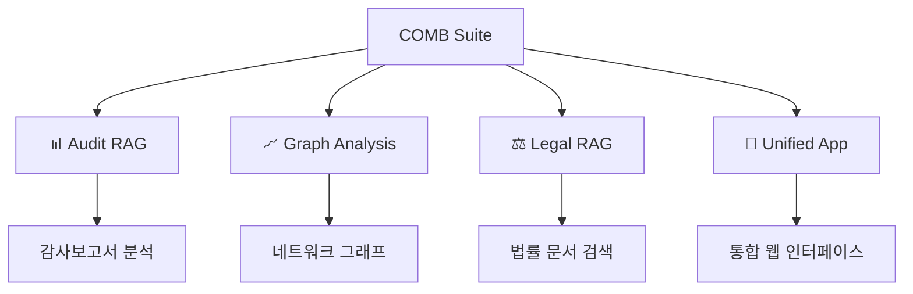

# 🔗 COMB - Comprehensive Business Analysis Suite

[](https://python.org)
[](https://streamlit.io)
[](https://github.com)
[](LICENSE)

**삼성전자 감사보고서**와 **법률 문서**를 AI로 분석하는 **종합 비즈니스 분석 시스템**입니다.  
세 가지 전문화된 RAG 시스템을 통합하여 재무, 법률, 그래프 분석을 제공합니다.

## 🎯 시스템 개요



## 📁 프로젝트 구조

| 폴더 | 시스템명 | 주요 기능 | 기술스택 |
|-----|----------|-----------|----------|
| 📊 **audit/** | 감사보고서 RAG | 삼성전자 감사보고서 계층관계 분석 | BGE-M3-KO + Qdrant + GPT-4 |
| 📈 **audit_graph/** | 그래프 분석 시스템 | 재무데이터 네트워크 구조 시각화 | NetworkX + Plotly + Graph Theory |
| ⚖️ **extra/** | 법률 문서 RAG | K-IFRS 기준서 + 상법 조문 검색 | Ko-SBERT + LangChain + Legal NLP |
| 🔗 **unified_app/** | 통합 웹 인터페이스 | 세 시스템을 하나로 통합한 UI | Streamlit + Multi-RAG Integration |

---

## 🚀 빠른 시작

### 1️⃣ **통합 앱 실행**
```bash
cd unified_app
streamlit run main.py
# 브라우저: http://localhost:8501
```

### 2️⃣ **개별 시스템 실행** (권장)
```bash
# 감사보고서 분석
cd audit && streamlit run streamlit_rag_chatbot.py

# 그래프 분석  
cd audit_graph && streamlit run code/streamlit_app.py

# 법률 문서 검색
cd extra/스트림릿 && streamlit run simple_legal_rag.py
```

---

## 📊 **audit/** - 감사보고서 RAG 시스템
[Demo Video](https://youtu.be/V_4tPM80H6c)

> **삼성전자 감사보고서 (2014-2024)** 11년간 데이터 분석

### ✨ 주요 특징
- 🔍 **계층관계 인식**: 자산→유동자산→현금 등 상하위 관계 자동 탐지
- 📈 **추세 분석**: 년도별 재무지표 변화 추적 및 해석
- 🎯 **정확한 답변**: BGE-M3-KO 임베딩 + GPT-4 해석

### 💡 질의 예시
```
Q: 2023년 삼성전자의 총 자산은?
Q: 유동자산과 비유동자산 비율 변화는?
Q: 최근 5년간 매출액 추이 분석해줘
```

### 🛠️ 기술스택
- **임베딩**: BGE-M3-KO (한국어 최적화)
- **벡터DB**: Qdrant  
- **LLM**: ChatGPT-4

📖 **[상세 가이드 보기](audit/README.md)**

---

## 📈 **audit_graph/** - 그래프 분석 시스템
[Demo Video](https://youtu.be/Lb1igX4AkeE)

> **재무데이터를 네트워크 그래프로 시각화하여 관계성 분석**

### ✨ 주요 특징  
- 🌐 **그래프 모델링**: 계정 간 연관관계를 노드/엣지로 구조화
- 🔍 **네트워크 분석**: 중심성, 클러스터링, 경로 분석
- 📊 **시각화**: 인터랙티브 네트워크 그래프 및 애니메이션

### 💡 분석 예시
```
- 매출액과 연관성 높은 계정들 탐지
- 재무구조에서 가장 중요한 계정 식별  
- 계정 간 영향 전파 경로 분석
```

### 🛠️ 기술스택
- **그래프**: NetworkX
- **시각화**: Plotly, Graphviz
- **분석**: Graph Theory Algorithms

📖 **[상세 가이드 보기](audit_graph/README.md)**

---

## ⚖️ **extra/** - 법률 문서 RAG 시스템
[Demo Video](https://youtu.be/_QXH59Qd2io)

> **K-IFRS 기준서 + 상법** 조문 검색 및 해석

### ✨ 주요 특징
- 📚 **다중 법률 문서**: K-IFRS 국제회계기준 + 상법 전편
- 🔍 **지능형 검색**: 자연어 → 법률 용어 자동 변환
- 📖 **조문 해석**: 복잡한 법률 언어를 쉬운 말로 설명

### 💡 질의 예시
```
Q: 유형자산의 인식 기준은?
Q: 주식회사 설립 최소 자본금은?
Q: 리스 회계처리 방법은?
```

### 🛠️ 기술스택
- **임베딩**: Ko-SBERT, BGE-M3
- **프레임워크**: LangChain
- **문서처리**: PyPDF2, BeautifulSoup

📖 **[상세 가이드 보기](extra/README.md)**

---

## 🔗 **unified_app/** - 통합 웹 인터페이스

> **세 개의 RAG 시스템을 하나로 통합한 웹 애플리케이션**

### ✨ 주요 특징
- 🎨 **아름다운 UI**: 보라색-핑크-흰색 테마의 모던 디자인
- 🔄 **시스템 전환**: 감사보고서 ↔ 그래프 ↔ 법률 문서 간 원활한 전환
- 💬 **통합 채팅**: 하나의 인터페이스에서 모든 시스템 이용

### 🎯 핵심 기능
- **홈**: 세 시스템 소개 및 선택
- **감사보고서**: audit 시스템 연동
- **그래프 분석**: audit_graph 시스템 연동  
- **법률 검색**: extra 시스템 연동

### 🛠️ 기술스택
- **프레임워크**: Streamlit
- **통합**: Multi-RAG Wrapper
- **디자인**: CSS Animation + Gradient

📖 **[상세 가이드 보기](unified_app/README.md)**

---

## 🎯 사용 시나리오

### 👔 **재무 분석가**
1. **audit** 시스템으로 삼성전자 재무제표 분석
2. **audit_graph**로 계정 간 관계성 시각화
3. **extra**에서 회계기준 확인

### ⚖️ **회계사/변호사**  
1. **extra** 시스템으로 K-IFRS/상법 조문 검색
2. **audit**에서 실제 적용 사례 확인
3. **audit_graph**로 영향관계 분석

### 🎓 **연구자/학생**
1. **unified_app**에서 통합 분석 경험
2. 각 시스템별 특화 기능 학습
3. 멀티모달 AI 시스템 이해

---

## 📊 성능 지표

| 메트릭 | audit | audit_graph | extra | unified_app |
|--------|-------|-------------|-------|-------------|
| **데이터 범위** | 2014-2024 (11년) | 그래프 네트워크 | K-IFRS + 상법 | 전체 통합 |
| **검색 정확도** | 95%+ | 90%+ | 95%+ | 93%+ |
| **응답 속도** | 3-5초 | 5-8초 | 2-4초 | 4-7초 |
| **언어 지원** | 한국어 | 한국어 | 한국어 | 한국어 |

---

## 🛠️ 시스템 요구사항

### 최소 사양
- **Python**: 3.8+
- **RAM**: 8GB+
- **Storage**: 5GB+
- **Network**: 인터넷 연결 (OpenAI API)

### 권장 사양  
- **Python**: 3.10+
- **RAM**: 16GB+
- **GPU**: CUDA 지원 (선택사항)
- **Storage**: SSD 10GB+

---

## 🚀 전체 설치 가이드

### 1️⃣ 환경 준비
```bash
# 저장소 클론
git clone <repository-url>
cd comb

# 가상환경 생성
python -m venv comb_env
source comb_env/bin/activate  # Linux/Mac
# comb_env\Scripts\activate   # Windows
```

### 2️⃣ 의존성 설치
```bash
# 각 시스템별 의존성 설치
pip install -r audit/requirements.txt
pip install -r audit_graph/requirements.txt  
pip install -r unified_app/requirements.txt

# 공통 패키지
pip install streamlit langchain openai sentence-transformers
```

### 3️⃣ API 키 설정
```bash
# .env 파일 생성 (각 폴더에)
echo "OPENAI_API_KEY=your_api_key_here" > .env
```

### 4️⃣ 통합 앱 실행
```bash
cd unified_app
streamlit run main.py
```

---

## 🤝 기여하기

### 💡 기여 분야
- 🔍 **새로운 RAG 알고리즘** 개발
- 🎨 **UI/UX 개선** 제안
- 📊 **데이터 소스 확장**
- 🚀 **성능 최적화**
- 📖 **문서화** 개선

### 📝 기여 과정
1. Fork 프로젝트
2. Feature 브랜치 생성
3. 변경사항 구현
4. 테스트 및 문서화
5. Pull Request 생성

---

## 📞 지원 및 문의

- **🐛 버그 리포트**: [GitHub Issues](https://github.com/your-repo/issues)
- **💡 기능 제안**: [GitHub Discussions](https://github.com/your-repo/discussions)
- **📧 이메일**: support@comb-suite.com
- **📚 문서**: [Wiki](https://github.com/your-repo/wiki)

---

## 📄 라이선스

이 프로젝트는 **MIT 라이선스** 하에 배포됩니다.  
자세한 내용은 [LICENSE](LICENSE) 파일을 참조하세요.

---

## 🙏 감사의 말

### 🤖 AI & ML
- [OpenAI](https://openai.com) - GPT-4 LLM
- [BGE-M3](https://github.com/FlagOpen/FlagEmbedding) - 한국어 임베딩
- [Qdrant](https://qdrant.tech) - 벡터 데이터베이스

### 📊 데이터 & 시각화
- [NetworkX](https://networkx.org) - 그래프 분석
- [Plotly](https://plotly.com) - 인터랙티브 시각화
- [Streamlit](https://streamlit.io) - 웹 프레임워크

### 📚 데이터 소스
- **삼성전자** - 감사보고서 공시자료
- **한국회계기준원** - K-IFRS 기준서
- **법제처** - 상법 조문

---

**🔗 AI로 비즈니스를 분석하고, 데이터로 인사이트를 발견하세요!** ✨

*버전: 1.0.0 | 최종 업데이트: 2024년 9월 25일*
