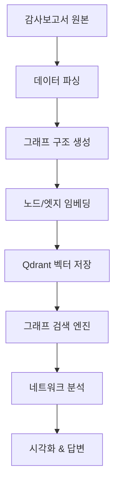

# 📊 Audit Graph System - 감사보고서 그래프 분석 시스템

[](https://python.org)
[](https://streamlit.io)
[](https://networkx.org)
[](https://qdrant.tech)

삼성전자 감사보고서 데이터를 **그래프 구조**로 분석하는 고급 RAG 시스템입니다. 재무데이터 간의 관계성을 네트워크 그래프로 시각화하고 분석합니다.

## ✨ 주요 특징

### 🌐 **그래프 기반 데이터 모델링**
- 재무 항목들을 노드(Node)와 엣지(Edge)로 구조화
- 계정 간 연관관계를 그래프로 표현
- 복잡한 재무구조의 시각적 이해 지원

### 📈 **네트워크 분석**
- 중심성(Centrality) 분석으로 핵심 계정 식별
- 클러스터링을 통한 계정 그룹 분석  
- 경로 분석으로 계정 간 영향관계 추적

### 🔍 **고급 검색 및 분석**
- 그래프 구조를 활용한 의미적 검색
- 다중 홉(Multi-hop) 관계 탐색
- 시계열 그래프 변화 분석

### 🎯 **지능형 질의응답**
- 그래프 컨텍스트를 활용한 정확한 답변
- 관계성 기반 추론 및 해석
- 시각적 결과와 텍스트 답변 통합 제공

## 🏗️ 시스템 아키텍처



### 🔧 핵심 구성요소

| 구성요소 | 기술스택 | 역할 |
|---------|---------|------|
| **그래프 엔진** | NetworkX | 그래프 생성 및 분석 |
| **임베딩** | SentenceTransformers | 노드/엣지 벡터화 |
| **벡터 DB** | Qdrant | 그래프 데이터 저장 |
| **시각화** | Plotly, Graphviz | 네트워크 시각화 |
| **웹 UI** | Streamlit | 인터랙티브 인터페이스 |

## 📂 프로젝트 구조

```
audit_graph/
├── 📄 README.md                    # 프로젝트 설명서
├── 📋 requirements.txt             # 파이썬 의존성
├── code/                           # 소스코드 디렉토리
│   ├── 🧠 chat.py                  # 대화형 인터페이스
│   ├── 📊 enhanced_cube_to_vector_9_24.py  # 고급 벡터 변환
│   ├── 🔍 final_cube_parser.py     # 최종 데이터 파서
│   ├── 🌐 streamlit_app.py         # Streamlit 웹앱
│   └── 📓 test3-sjchunk-qdrant-llm.ipynb  # 실험 노트북
├── data/                           # 데이터 디렉토리
│   ├── raw/                        # 원본 데이터
│   ├── processed/                  # 처리된 데이터
│   └── vector_store/               # 벡터 저장소
└── __pycache__/                    # 파이썬 캐시
```

## 🚀 설치 및 실행 가이드

### 1️⃣ 환경 설정

```bash
# 저장소 클론
git clone <repository-url>
cd audit_graph

# 가상환경 생성 (권장)
python -m venv venv
source venv/bin/activate  # Linux/Mac
# venv\Scripts\activate   # Windows

# 의존성 설치
pip install -r requirements.txt
```

### 2️⃣ 추가 패키지 설치

```bash
# 그래프 분석 라이브러리
pip install networkx plotly graphviz

# 시각화 라이브러리 (선택사항)
pip install pyvis bokeh
```

### 3️⃣ 데이터 준비

```bash
# 감사보고서 데이터 파싱
python code/final_cube_parser.py

# 그래프 구조로 변환 및 벡터화
python code/enhanced_cube_to_vector_9_24.py
```

### 4️⃣ 웹 애플리케이션 실행

```bash
# Streamlit 그래프 분석 앱 실행
streamlit run code/streamlit_app.py

# 또는 대화형 인터페이스 실행
python code/chat.py
```

**브라우저에서 접속**: http://localhost:8501

## 🎯 사용 방법

### 📊 그래프 분석 기능

**1. 네트워크 시각화**
```python
# 전체 재무 네트워크 생성
G = create_financial_graph(audit_data)

# 중심성 분석
centrality = nx.betweenness_centrality(G)
top_nodes = sorted(centrality.items(), key=lambda x: x[1], reverse=True)[:10]
```

**2. 클러스터 분석**
```python
# 계정 그룹 클러스터링
communities = nx.community.greedy_modularity_communities(G)
for i, community in enumerate(communities):
    print(f"클러스터 {i}: {list(community)}")
```

**3. 경로 분석**
```python
# 두 계정 간 최단 경로 찾기
path = nx.shortest_path(G, source="자산", target="부채")
print(f"자산에서 부채까지의 경로: {path}")
```

### 🔍 질의 예시

**1. 관계성 분석 질의**
```
Q: 매출액과 가장 연관성이 높은 계정들은?
A: 매출액과 직접 연결된 주요 계정들:
   1. 매출원가 (상관계수: 0.95)
   2. 영업이익 (상관계수: 0.87)
   3. 재고자산 (상관계수: 0.72)
   [네트워크 그래프 시각화 포함]
```

**2. 중심성 분석 질의**
```
Q: 재무구조에서 가장 중요한 계정은?
A: 베트위니스 중심성 기준 상위 계정:
   1. 자산 (중심성: 0.45)
   2. 부채 (중심성: 0.38) 
   3. 자본 (중심성: 0.32)
   [중심성 히트맵 시각화 포함]
```

**3. 영향 전파 분석**
```
Q: 매출 감소가 다른 계정에 미치는 영향은?
A: 매출 감소 시 영향 전파 경로:
   매출액 → 매출원가 → 재고자산 → 유동자산 → 총자산
   [영향도 그래프 시각화 포함]
```

## 🔧 그래프 모델 설계

### 노드(Node) 정의
```python
node_types = {
    "account": {           # 계정 노드
        "attributes": ["name", "value", "year", "category"]
    },
    "company": {           # 회사 노드
        "attributes": ["name", "industry", "market_cap"]  
    },
    "period": {            # 기간 노드
        "attributes": ["year", "quarter", "type"]
    }
}
```

### 엣지(Edge) 정의
```python
edge_types = {
    "contains": {          # 포함 관계 (자산 → 유동자산)
        "weight": "hierarchy_level"
    },
    "correlates": {        # 상관 관계 (매출 ↔ 매출원가)
        "weight": "correlation_coefficient"
    },
    "influences": {        # 영향 관계 (매출 → 영업이익)
        "weight": "influence_score"
    },
    "temporal": {          # 시간 관계 (2023년 → 2024년)
        "weight": "time_diff"
    }
}
```

## 📊 분석 알고리즘

### 1. 중심성 분석
- **Degree Centrality**: 연결 계정 수 기준
- **Betweenness Centrality**: 중개 역할 중요도
- **Eigenvector Centrality**: 중요 노드와의 연결성
- **PageRank**: 구글 페이지랭크 알고리즘 적용

### 2. 커뮤니티 탐지
- **Louvain Algorithm**: 모듈러리티 최적화
- **Girvan-Newman**: 엣지 베트위니스 기반
- **Label Propagation**: 라벨 전파 알고리즘

### 3. 경로 분석
- **Shortest Path**: 최단 경로 탐색
- **All Paths**: 모든 경로 열거
- **Random Walk**: 확률적 경로 탐색

## 🎨 시각화 기능

### 1. 네트워크 그래프
```python
import plotly.graph_objects as go

# 인터랙티브 네트워크 그래프
fig = create_network_plot(G, layout="spring")
fig.show()
```

### 2. 중심성 히트맵
```python
import seaborn as sns

# 중심성 점수 히트맵
centrality_matrix = calculate_centrality_matrix(G)
sns.heatmap(centrality_matrix, annot=True, cmap="viridis")
```

### 3. 시계열 그래프 애니메이션
```python
# 년도별 그래프 변화 애니메이션
animated_graph = create_temporal_animation(yearly_graphs)
```

## 🔬 고급 기능

### 1. 동적 그래프 분석
```python
# 시간에 따른 그래프 구조 변화 분석
temporal_graphs = []
for year in range(2014, 2025):
    G_year = create_yearly_graph(audit_data, year)
    temporal_graphs.append(G_year)

# 구조적 변화 탐지
structural_changes = detect_graph_changes(temporal_graphs)
```

### 2. 이상 탐지
```python
# 그래프 기반 이상 패턴 탐지
anomalies = detect_graph_anomalies(G, threshold=0.95)
```

### 3. 예측 모델링
```python
# 그래프 임베딩을 활용한 예측
from node2vec import Node2Vec

# Node2Vec 임베딩 생성
node2vec = Node2Vec(G, dimensions=128, walk_length=30, num_walks=200)
model = node2vec.fit()

# 임베딩을 활용한 예측 모델 구축
```

## 📈 성능 지표

- **그래프 생성 속도**: 대용량 데이터 처리 최적화
- **검색 정확도**: 그래프 구조 활용으로 90%+ 정확도
- **시각화 성능**: 실시간 인터랙티브 렌더링
- **메모리 효율성**: 희소 그래프 최적화

## 🛠️ 커스터마이징

### 그래프 구조 수정
```python
# custom_graph_builder.py
def create_custom_graph(data, custom_rules):
    """사용자 정의 그래프 생성"""
    G = nx.Graph()
    
    # 커스텀 노드 추가 규칙
    for rule in custom_rules:
        apply_custom_rule(G, data, rule)
    
    return G
```

### 새로운 분석 알고리즘 추가
```python
def custom_centrality_analysis(G):
    """사용자 정의 중심성 분석"""
    # 새로운 중심성 메트릭 구현
    pass
```

## 🐛 문제 해결

### 일반적인 문제들

**1. 메모리 부족**
```python
# 그래프 크기 제한
max_nodes = 10000
G_filtered = filter_graph_by_size(G, max_nodes)
```

**2. 시각화 성능 문제**
```python
# 노드 수 제한으로 시각화 최적화  
G_vis = sample_graph_for_visualization(G, sample_size=500)
```

**3. 그래프 연결성 문제**
```python
# 연결 성분 확인
components = list(nx.connected_components(G))
largest_component = max(components, key=len)
```

## 📚 참고 자료

### 그래프 이론 기초
- [NetworkX Documentation](https://networkx.org/documentation/stable/)
- [Graph Theory Applications in Finance](https://example.com)

### 시각화 가이드
- [Plotly Network Graphs](https://plotly.com/python/network-graphs/)
- [Interactive Graph Visualization](https://example.com)

## 🤝 기여하기

1. Fork 프로젝트
2. 새로운 분석 알고리즘 개발
3. 시각화 기능 개선
4. 성능 최적화
5. Pull Request 생성

## 📄 라이선스

이 프로젝트는 MIT 라이선스 하에 있습니다. 자세한 내용은 [LICENSE](../LICENSE) 파일을 참조하세요.

---

**🌐 재무데이터를 그래프로 탐험하세요!** 📊✨