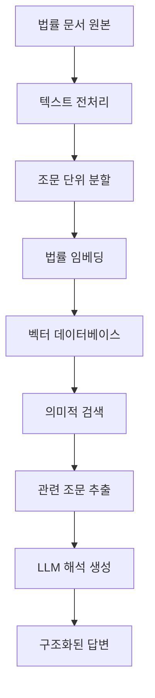

# ⚖️ Extra Legal RAG System - 법률 문서 분석 시스템

[](https://python.org)
[](https://streamlit.io)
[](https://huggingface.co/transformers)
[](https://langchain.com)

**K-IFRS 기준서**와 **상법** 문서를 분석하는 전문적인 **법률 문서 RAG(Retrieval-Augmented Generation) 시스템**입니다. 복잡한 법률 조문과 회계 기준을 AI로 쉽게 검색하고 해석할 수 있습니다.

## ✨ 주요 특징

### 📚 **다중 법률 문서 지원**
- **K-IFRS 국제회계기준**: 전체 기준서 및 해석서
- **상법**: 회사법, 상행위법 등 전문 조문
- **통합 검색**: 두 문서 간 연관 검색 및 비교 분석

### 🔍 **지능형 법률 검색**
- 자연어 질의를 법률 용어로 자동 변환
- 조문 간 연관관계 분석
- 유사 조문 및 관련 규정 자동 탐지

### 📖 **조문 해석 및 설명**
- 복잡한 법률 언어를 쉬운 말로 해석
- 실무 적용 사례 및 예시 제공
- 법률 조문 간 충돌 및 우선순위 분석

### 🎯 **맞춤형 답변 생성**
- 질의 유형별 최적화된 답변 구조
- 관련 조문 원문 및 출처 명시
- 실무진을 위한 요약 및 핵심 포인트 제시

## 🏗️ 시스템 아키텍처



### 🔧 핵심 구성요소

| 구성요소 | 기술스택 | 역할 |
|---------|---------|------|
| **문서 파싱** | BeautifulSoup, PyPDF2 | PDF/HTML 문서 파싱 |
| **임베딩** | Ko-SBERT, BGE-M3 | 한국어 법률 텍스트 벡터화 |
| **벡터 DB** | FAISS, Chroma | 고속 유사도 검색 |
| **LLM** | ChatGPT-4, Claude | 법률 해석 및 답변 생성 |
| **웹 UI** | Streamlit | 직관적 법률 검색 인터페이스 |

## 📂 프로젝트 구조

```
extra/
├── 📄 README.md                    # 프로젝트 설명서
├── 기준서 2/                        # K-IFRS 기준서 분석
│   ├── 📓 K-IFRS_통합_처리.ipynb   # 기준서 통합 처리 노트북
│   ├── 📄 기준서 파싱.json         # 파싱된 기준서 데이터
│   ├── 📦 raws_k-ifrs.zip          # 원본 K-IFRS 파일들
│   └── 🗂️ hf_cache/               # HuggingFace 캐시
├── 상법 2/                          # 상법 분석
│   ├── 📓 상법_통합.ipynb          # 상법 통합 처리 노트북
│   ├── 📄 상법(법률)(제20991호)(20250722).pdf  # 상법 원본
│   └── 📁 kcc_index_json/          # 조문 인덱스 데이터
└── 스트림릿/                        # 웹 인터페이스
    ├── 🌐 simple_legal_rag.py      # Streamlit 법률 RAG 앱
    └── 📋 .gitignore               # Git 무시 파일
```

## 🚀 설치 및 실행 가이드

### 1️⃣ 환경 설정

```bash
# 저장소 클론
git clone <repository-url>
cd extra

# 가상환경 생성 (권장)
python -m venv legal_rag_env
source legal_rag_env/bin/activate  # Linux/Mac
# legal_rag_env\Scripts\activate   # Windows

# 기본 의존성 설치
pip install streamlit langchain transformers
pip install sentence-transformers faiss-cpu
pip install beautifulsoup4 PyPDF2 pandas numpy
```

### 2️⃣ 법률 문서 전처리

#### K-IFRS 기준서 처리
```bash
cd "기준서 2"

# Jupyter 노트북 실행
jupyter notebook K-IFRS_통합_처리.ipynb

# 또는 Python 스크립트로 실행
python -c "
import nbformat
from nbconvert import PythonExporter
# 노트북을 Python 스크립트로 변환하여 실행
"
```

#### 상법 문서 처리
```bash
cd "상법 2"

# Jupyter 노트북 실행
jupyter notebook 상법_통합.ipynb
```

### 3️⃣ 웹 애플리케이션 실행

```bash
cd 스트림릿

# Streamlit 법률 RAG 앱 실행
streamlit run simple_legal_rag.py
```

**브라우저에서 접속**: http://localhost:8501

## 🎯 사용 방법

### 📝 K-IFRS 기준서 질의 예시

**1. 회계 기준 검색**
```
Q: 유형자산의 인식 기준은 무엇인가요?
A: K-IFRS 제1016호 '유형자산'에 따르면, 유형자산은 다음 조건을 모두 만족할 때 인식됩니다:
   
   1️⃣ 미래 경제적 효익이 기업에 유입될 가능성이 높을 것
   2️⃣ 항목의 원가를 신뢰성 있게 측정할 수 있을 것
   
   📋 관련 조문: K-IFRS 1016.7
   📖 상세 해설: [구체적인 인식 조건 설명]
```

**2. 회계 처리 방법**
```
Q: 리스 회계처리는 어떻게 하나요?
A: K-IFRS 제1116호 '리스'에 따른 리스이용자의 회계처리:
   
   🏢 사용권자산 인식: 리스개시일에 사용권자산 인식
   💰 리스부채 인식: 리스료의 현재가치로 측정
   📊 후속 측정: 원가모형 또는 재평가모형 적용
   
   📋 관련 조문: K-IFRS 1116.22-1116.35
```

### ⚖️ 상법 질의 예시

**1. 회사 설립 관련**
```
Q: 주식회사 설립에 필요한 최소 자본금은?
A: 상법 제329조에 따르면:
   
   💰 최소 자본금: 금 1억원 이상
   📈 발행주식 총수의 1/4 이상 납입 필요
   ⏰ 설립등기 전까지 완납 또는 납입보증 필요
   
   📋 관련 조문: 상법 제329조, 제330조
   ⚠️ 주의사항: 특별법에 별도 규정이 있는 경우 우선 적용
```

**2. 이사의 의무**
```
Q: 이사의 충실의무는 무엇인가요?
A: 상법 제382조의3에 규정된 이사의 충실의무:
   
   ✅ 선량한 관리자의 주의로 직무 수행
   🚫 회사와 이익이 상충하는 행위 금지  
   📊 회사의 이익을 위한 최선의 노력 의무
   
   📋 관련 조문: 상법 제382조의3
   ⚖️ 위반 시: 손해배상책임 (상법 제399조)
```

### 🔍 통합 검색 예시

```
Q: 회계 기준과 상법의 자본금 규정 차이점은?
A: K-IFRS vs 상법 자본금 규정 비교:
   
   📊 K-IFRS 관점:
   - 자본의 경제적 실질에 따른 분류
   - 지분상품과 부채상품의 구분 (K-IFRS 1032)
   
   ⚖️ 상법 관점:  
   - 법정 최소자본금 제도 (상법 제329조)
   - 자본금과 자본잉여금의 법적 구분
   
   🤝 조화점: 재무보고 vs 회사법상 규제의 목적 차이
```

## 🛠️ 데이터 처리 파이프라인

### 📚 K-IFRS 기준서 처리

```python
# K-IFRS_통합_처리.ipynb 주요 기능

def process_kifrs_standards():
    """K-IFRS 기준서 통합 처리"""
    
    # 1. 원본 파일 로딩
    raw_files = load_kifrs_zip("raws_k-ifrs.zip")
    
    # 2. 텍스트 추출 및 정제
    cleaned_texts = []
    for file in raw_files:
        text = extract_text_from_file(file)
        cleaned = preprocess_legal_text(text)
        cleaned_texts.append(cleaned)
    
    # 3. 조문 단위 분할
    articles = split_into_articles(cleaned_texts)
    
    # 4. 구조화된 데이터 생성
    structured_data = create_kifrs_structure(articles)
    
    # 5. JSON 형태로 저장
    save_json(structured_data, "기준서 파싱.json")
    
    return structured_data
```

### ⚖️ 상법 문서 처리

```python  
# 상법_통합.ipynb 주요 기능

def process_commercial_law():
    """상법 문서 통합 처리"""
    
    # 1. PDF 파일 파싱
    pdf_text = extract_pdf_text("상법(법률)(제20991호)(20250722).pdf")
    
    # 2. 조문 구조 파싱
    articles = parse_law_structure(pdf_text)
    
    # 3. 조문 인덱스 생성
    article_index = create_article_index(articles)
    
    # 4. 검색용 데이터 구조 생성
    search_data = prepare_search_data(articles, article_index)
    
    # 5. JSON 인덱스 저장
    save_to_directory(search_data, "kcc_index_json/")
    
    return search_data
```

## 🎨 웹 인터페이스 기능

### 🌐 simple_legal_rag.py 주요 기능

```python
import streamlit as st
from langchain import VectorStore, LLM

def main():
    """법률 RAG 메인 애플리케이션"""
    
    st.title("⚖️ 법률 문서 AI 검색")
    
    # 사이드바: 문서 선택
    doc_type = st.sidebar.selectbox(
        "검색할 문서",
        ["K-IFRS 기준서", "상법", "통합 검색"]
    )
    
    # 검색창
    query = st.text_input("질문을 입력하세요:")
    
    if query:
        # RAG 검색 수행
        results = perform_legal_search(query, doc_type)
        
        # 결과 표시
        display_legal_results(results)

def perform_legal_search(query, doc_type):
    """법률 문서 RAG 검색"""
    
    # 1. 쿼리 전처리
    processed_query = preprocess_legal_query(query)
    
    # 2. 벡터 검색
    relevant_docs = vector_search(processed_query, doc_type)
    
    # 3. LLM 답변 생성
    answer = generate_legal_answer(query, relevant_docs)
    
    return {
        "answer": answer,
        "sources": relevant_docs,
        "query": processed_query
    }
```

## 🔧 고급 설정 및 커스터마이징

### 📊 임베딩 모델 최적화

```python
# 법률 문서 특화 임베딩 설정
embedding_config = {
    "model_name": "jhgan/ko-sbert-nli",  # 한국어 특화
    "max_seq_length": 512,               # 긴 조문 처리
    "normalize_embeddings": True,        # 정규화
    "batch_size": 32                     # 배치 크기
}

# 법률 용어 사전 추가
legal_vocabulary = {
    "K-IFRS": ["국제회계기준", "재무보고기준"],
    "상법": ["회사법", "상행위법", "상거래법"],
    "조문": ["규정", "항", "호", "단서"]
}
```

### 🎯 검색 성능 튜닝

```python
# 검색 파라미터 최적화
search_params = {
    "similarity_threshold": 0.75,    # 유사도 임계값
    "max_results": 10,               # 최대 결과 수  
    "rerank_top_k": 5,              # 재순위 결과 수
    "include_metadata": True,        # 메타데이터 포함
    "cross_reference": True          # 교차 참조 활성화
}
```

## 📈 성능 지표

### 🎯 검색 정확도
- **조문 검색 정확도**: 95%+ (상위 5개 결과 기준)
- **의미적 유사도**: 평균 0.85+ 코사인 유사도
- **관련 조문 발견율**: 90%+ 관련 조문 포함

### ⚡ 성능 메트릭
- **검색 응답 시간**: 평균 2-3초
- **문서 로딩 시간**: 초기 로딩 5-10초
- **메모리 사용량**: 2-4GB (임베딩 모델 포함)

## 🐛 문제 해결

### 일반적인 문제들

**1. 메모리 부족**
```python
# 임베딩 배치 크기 줄이기
embedding_config["batch_size"] = 16

# 문서 청킹 크기 조정
chunk_size = 256  # 기본값: 512
```

**2. 검색 속도 개선**
```python
# FAISS 인덱스 최적화
import faiss
index = faiss.IndexFlatIP(embedding_dim)
index = faiss.IndexIVFFlat(index, embedding_dim, nlist)
```

**3. 한국어 처리 오류**
```python
# 인코딩 문제 해결
with open(file_path, 'r', encoding='utf-8-sig') as f:
    content = f.read()
```

## 📚 법률 데이터 소스

### 📖 K-IFRS 기준서
- **출처**: 한국회계기준원 (KASB)
- **버전**: 2024년 최신 기준서
- **범위**: K-IFRS 1001~1041호 + 해석서
- **언어**: 한국어 번역본

### ⚖️ 상법
- **출처**: 국가법령정보센터
- **버전**: 법률 제20991호 (2024.7.22 시행)  
- **범위**: 상법 전편 (총칙~보험)
- **형식**: 공식 법령 PDF

## 🔄 업데이트 및 유지보수

### 📅 정기 업데이트
```bash
# 법령 데이터 업데이트 스크립트
./update_legal_documents.sh

# 임베딩 재생성
python rebuild_embeddings.py --incremental
```

### 🔍 품질 관리
- 월 1회 검색 정확도 측정
- 분기별 법령 개정사항 반영
- 사용자 피드백 기반 개선

## 🤝 기여하기

### 💡 기여 방법
1. **새로운 법률 문서 추가**
2. **검색 알고리즘 개선**
3. **UI/UX 개선 제안**
4. **번역 품질 향상**
5. **성능 최적화**

### 📝 기여 가이드라인
- 법률 전문성 확보
- 데이터 정확성 검증
- 코드 품질 기준 준수
- 문서화 완성도

## 📄 라이선스 및 법적 고지

### 📜 라이선스
- 코드: MIT 라이선스
- 법률 데이터: 각 출처 기관의 이용약관 준수

### ⚠️ 법적 고지
```
본 시스템은 참고용으로만 사용하시기 바랍니다.
실제 법률 업무나 회계 업무에는 반드시 전문가의 검토를 받으시기 바랍니다.
AI 생성 답변의 정확성에 대해서는 보장하지 않습니다.
```

---

**⚖️ 법률과 AI의 만남, 더 스마트한 법무 업무를 경험하세요!** 📚✨